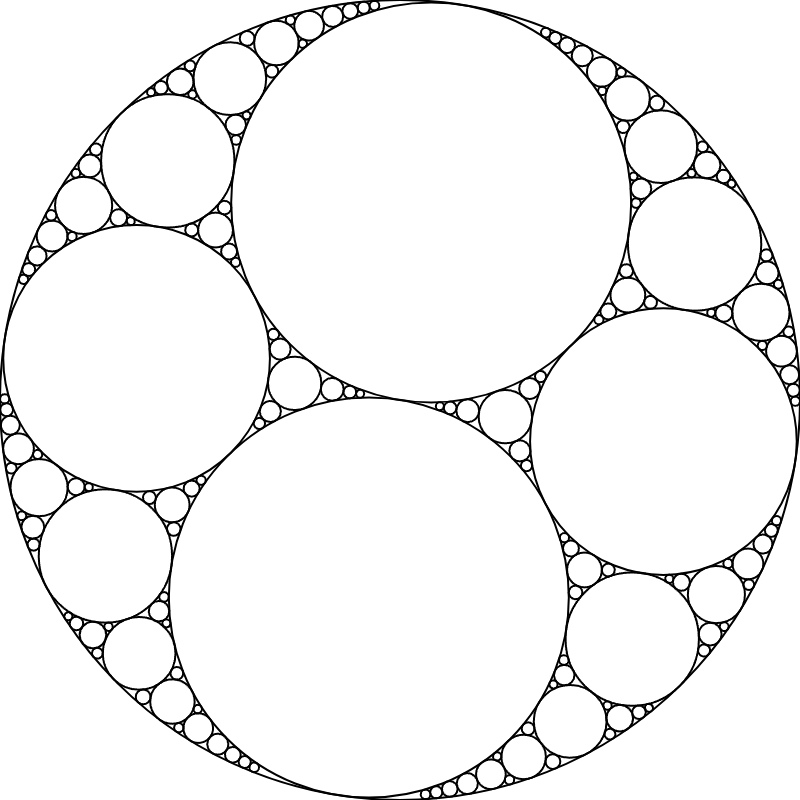

# Apollonian Gasket - p5.js

## Demo

Hosted using Github Pages: [https://srirajbehera.github.io/Apollonian-Gasket-p5js/](https://srirajbehera.github.io/Apollonian-Gasket-p5js/)

This project uses random() method to create new internal circles therefore on every refresh to the page, new Apollonian Gaskets will be created.

## Technologies used

HTML, CSS, JavaScript, p5.js

## Live Demo Images

1. Canvas size 400 x 400

  

2. Canvas size 300 x 300

  

3. Canvas size 200 x 200

  

4. Canvas size 100 x 100

  

## Inspiration

March 15 is celebrated as PI day in the world and to celebrate, I created an Apollonian Gasket using the Descartes Circle Theorem and complex numbers.

In mathematics, an Apollonian gasket or Apollonian net is a fractal generated by starting with a triple of circles, each tangent to the other two, and successively filling in more circles, each tangent to another three. It is named after Greek mathematician Apollonius of Perga.

Frederick Soddy, an English radiochemist, was awarded the Nobel Prize in Chemistry in 1921 for his significant contributions to our understanding of the chemistry of radioactive substances and his investigations into the origin and nature of isotopes. He penned a poem titled "The Kiss Precise" as a reflection of his fascination with the Problem of Apollonius, and his various efforts in contributing to its solution.

## Mathematics

The challenge posed by the Problem of Apollonius involves determining the circle or circles, $c_4$, that are tangent to three non-overlapping circles, $c_1$, $c_2$ and $c_3$. The resolution to this problem is found in Descartes' Circle Theorem, particularly in the context of the Apollonian Gasket, where the original three circles must be mutually tangent.

Curvature (or bend), $k$, for any circle having radius, $r$, can be defined as:
$$k = \frac{1}{r}$$

$k$ can be positive (circles inside the parent circle) or negative (the parent circle which has 2 sibling circles), therefore, the radius of the circle having a curvature $k$ is defined as:
$$r = \lvert \frac{1}{k} \rvert$$

Now, from the poem, The Kiss Precise, and Descartes Theorem, we get an equation of curvature defined as:
$$k_1^2 + k_2^2 + k_3^2 + k_4^2 = \frac{1}{2}(k_1 + k_2 + k_3 + k_4)^2$$

where $k_1$, $k_2$, $k_3$ and $k_4$ are curvatures of the circles $c_1$, $c_2$, $c_3$ and $c_4$ respectively.

Therefore, $k_4$ can be calculated as:
$$k_4 = k_1 + k_2 + k_3 \pm 2\sqrt{k_1k_2 + k_2k_3 + k_3k_1}$$

Next, we calculate the centers of the new circles using the Complex Descartes Theorem and we would have complex coordinates of the centers, essentially the equation:
$$z_1^2k_1^2 + z_2^2k_2^2 + z_3^2k_3^2 + z_4^2k_4^2 = \frac{1}{2} (z_1k_1 + z_2k_2 + z_3k_3 + z_4k_4)^2$$

where $z_1$, $z_2$, $z_3$ and $z_4$ are complex coordinates of the center of the 4 mutually tangential circles, $c_1$, $c_2$, $c_3$ and $c_4$ respectively.

We can calculate $z_4$ as:
$$z_4 = \frac{z_1k_1 + z_2k_2 + z_3k_3 \pm 2\sqrt{k_1k_2z_1z_2 + k_2k_3z_2z_3 + k_3k_1z_3z_1}}{k_4}$$

where $z$ is of the form $a + bi$, where, $i = \sqrt{-1}$ and $a, b \in \mathbb{R}$.

## References

1. Apollonian Gasket: https://en.wikipedia.org/wiki/Apollonian_gasket

2. A Tisket, a Tasket, an Apollonian Gasket: https://www.americanscientist.org/article/a-tisket-a-tasket-an-apollonian-gasket

3. Apollonian Gaskets: https://mathlesstraveled.com/2016/04/27/apollonian-gaskets/

4. Beyond the Descartes Circle Theorem: https://arxiv.org/pdf/math/0101066.pdf

5. The Kiss Precise: https://www.nature.com/articles/1371021a0#preview

6. Frederick Soddy: https://en.wikipedia.org/wiki/Frederick_Soddy

7. Problem of Apollonius: https://en.wikipedia.org/wiki/Problem_of_Apollonius

8. Four Proofs of a Generalization of the Descartes Circle Theorem: https://www.jstor.org/stable/2316373

9. Beyond the Descartes Circle Theorem: https://arxiv.org/pdf/math/0101066.pdf

10. Descartes' theorem: https://en.wikipedia.org/wiki/Descartes%27_theorem

11. Complex.js: https://www.npmjs.com/package/complex.js

12. p5.js: https://p5js.org

13. p5.js Web Editor: https://editor.p5js.org/

14. Processing: https://processing.org

---
